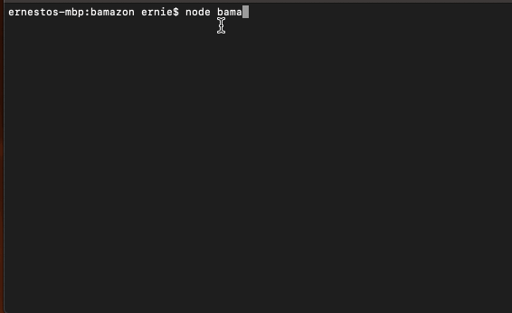

# bamazon

## Installation
Will need to run npm installations 
1. Will need to install mysql and inquirer
```bash
npm i mysql
npm i inquirer
```

## Usage
How to use bamazon
```bash
node bamazonCustomer.js
```



## Technologies
Used mySQL to create a database with 10 items that the user can select from
```bash
npm install --save node-spotify-api
```
Used inquirer and mySQL npms
```bash
npm i mysql
npm i inquirer
```

## Contributions
I created this CLI app in order to gain experience working with mySQL. This app allows the user to selected from a variety of items available. After the user selects what item they would like to purchase and the quantity of it, the database will be updated in real time.


